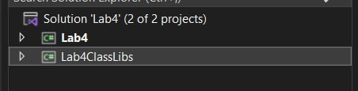
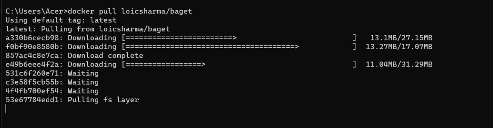
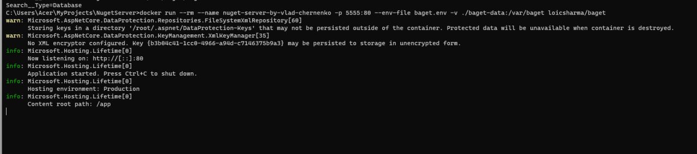
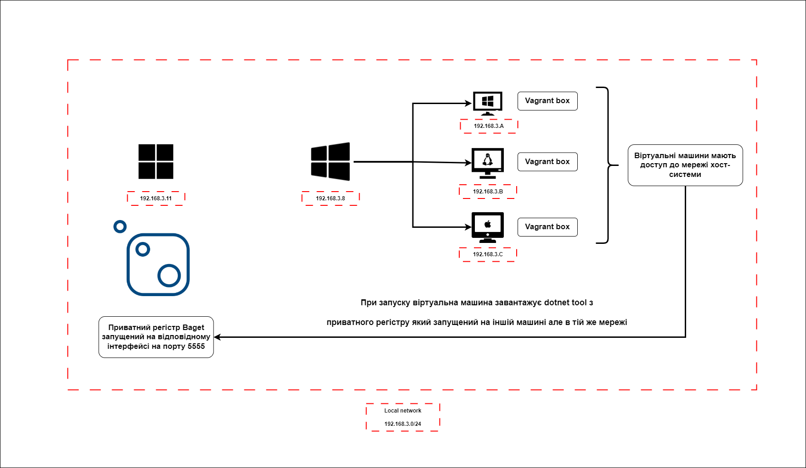
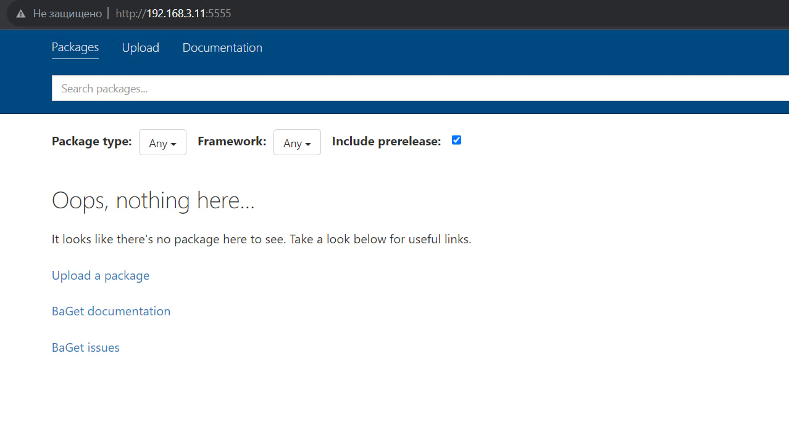

# Лабораторна робота 4

<br/><br/><br/>

# Створення структури кодової бази

Формулювання завдання спочатку може видатись складним, тож варто розібратись `step-by-step`. Перш за все, розберемось зі структурою кодової бази. Для цього в одному solution буде створено 2 проекти:

+  Бібліотека класів - тут буде 3 окремих файли з публічними функціями для експорту функціональності лабораторних робіт 1-3
+  Консольний застосунок - це власне сам CLI який буде запускати виконання лабораторних 1-3

<br/>

Перейдемо до `Visual Studio`. Після створення проектів, загальна структура solution має такий вигляд:

<br/>




<br/><br/><br/>

# Код написаний, що далі?

Локально все працює, але тепер треба продумати як це задеплоїти до регістру, а потім отримати з віртуальних машин.

Для локального регістру пакетів .NET був обраний **Baget**(згідно рекомендаціям в методичних вказівках)

> https://github.com/loic-sharma/BaGet


Оскільки не було часу розбиратися в вихідному коді + не знайшов рекомендацій щодо білду проекту + не звик запускати невідомі бінарники на власній машині, я обрав опцію запуску регістру через докер контейнер. Таким чином, достатньо тільки прокинути порт і надати файл для налаштування змінних середовища (`.env` файл).

> Більше інформації про запуск регістру як контейнер Docker можна знайти в документції проекту - https://loic-sharma.github.io/BaGet/installation/docker/

Файл `baget.env` у мене має такий вигляд:

```shell

# The following config is the API Key used to publish packages.
# You should change this to a secret value to secure your server.
ApiKey=password123

Storage__Type=FileSystem
Storage__Path=/var/baget/packages
Database__Type=Sqlite
Database__ConnectionString=Data Source=/var/baget/baget.db
Search__Type=Database

```

Завантажуємо відповідний образ:

```shell
docker pull loicsharma/baget
```



Та запускаємо контейнер

```shell
docker run --rm --name nuget-server-by-vlad-chernenko -p 5555:80 --env-file baget.env -v ./baget-data:/var/baget loicsharma/baget
```

Результат:




<br/><br/><br/>

# Перевірка доступності регістру та доступу з віртуальних машин

На моїй машині на якій запущений регістр `НЕ БУДУТЬ ЗАПУСКАТИСЯ ВІРТУАЛЬНІ МАШИНИ` через брак пам'яті. Отже, коли я сідав за роботу, то одразу продумав що регістр буде запущений на одній машині, а віртуальні машини - на іншій. Чому так? Бо на машині де невистачає пам'яті стоїть `Windows 11 Pro`, а на машині де будуть запущені віртуальні машини - `Windows 10 Home`. Home версія не дозволяє запустити Docker контейнери тож довелося виходити із ситуації таким чином. Загальна архітектура системи має такий вигляд:




Тут ви можете побачити основну машину з IP `192.168.3.11`(зліва) на якій запущено Docker контейнер з регістром Baget. В тій же мережі є інша машина - `192.168.3.8` на якій запускалися віртуальні машини з-під Vagrant.

На даній схемі також сказано, що в середовищі віртуальних машин ви будете мати доступ до хост-мережі(`192.168.3.0/24`) що дозволить нам запустити скрипт для отримання `dotnet tool` з регістру на `192.168.3.11:5555`


Консольний вивід показав, що регістр був запущений на всіх інтерфейсах машини(`[::]`), а отже якщо ми перейдемо в браузер по `http://192.168.3.11:5555`, то побачимо головну сторінку регістру:




<br/><br/><br/>

# Створення Vagrant файлів

Оберемо найпрості конфігурації для отримання мінімального шеллу до машини через `ssh`:


Для роботи було використано `VirtualBox`:

